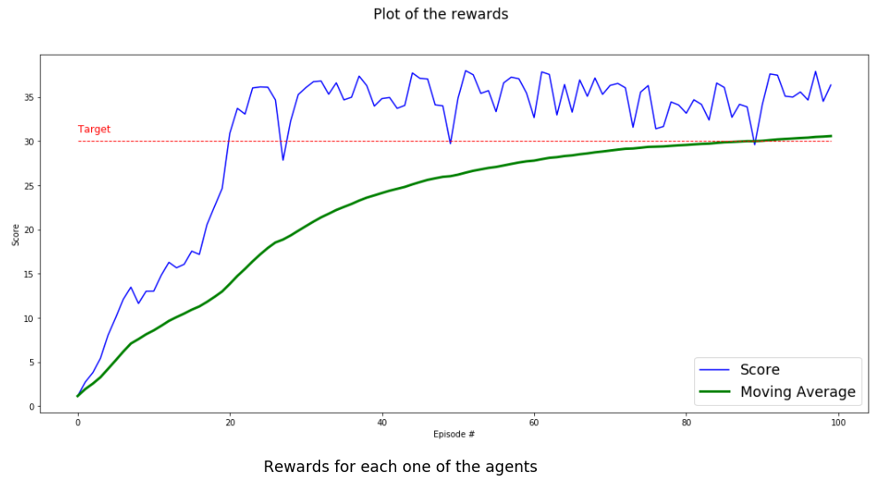

# Project 2: Continuous Control

## Implementation - Learning Algorithm

This project is part of Udacity's Deep Reinforcement Learning Nanodegree Program. The algorithm used to complete this project is the Deep Deterministic Policy Gradient (DDPG) based on the paper titled [Continuous control with deep reinforcement learning](https://arxiv.org/abs/1509.02971).

With distributed training, 20 identical agents, each with its own copy of the environment was used. An Actor-Critic method was chosen to train the agents. This is because the problem is considered to be too complex to be solved with just policy gradients approaches. There is the problem of the algorithm solving for a local maxima and not coming to an optimal solution. An actor-critic model would solve this because an actor model with low bias and high variance can be used to avoid cases where the algorithm solves for a local maxima. On the other hand, the critic model with low variance and high bias helps to speed up learning.

The Actor Network accepts 33 variables corresponding to the state observation space. This 33 variables is passed into the input layer with 33 nodes.
The first hidden layer has 400 nodes while the second hidden layer has 300 nodes. This output layer produces 4 variables which specify the best action based on the state observation.

The Critic Network accepts 33 variables corresponding to the state observation space. This 33 variables is passed into the input layer with 33 nodes. The first hidden layer has 400 nodes and inputs into the second hidden layer 400 numbers; additionally the second hidden layer also accepts the result from the output layer of the Actor Network. The size of this is 4 variables/nodes. The second hidden layer has 300 nodes and outputs 300 values to the output layer. The output layer accepts these 300 values to output a single value. This single value represents the predicted target value based on the observed state space and the estimated best action of the Actor Network. The Critic produces the optimal action-value function Q(s,a) based on the Actor's best action estimate.

## Hyperparameters

The hyperparameters chosen for this project are as follows:

The DDPG agent will explore the state space for a maximum timestep (max_t) of 1000 per episode.
The target_score of the agent is 30.0.
The target_episode of the agent is 100 episodes. Thus the agent will attempt to reach an average target_score of 30 over 100 episodes.

The neural network parameters are as follows:

batch_size = 128 (minibatch size)
buffer_size = int(1e5) (replay buffer size)
gamma = 0.99 (discount reward factor)
lr_actor = 1e-3 (learning rate, actor)
lr_critic = 1e-3 (learning rate, critic)
tau = 1e-3 (soft target updates rate)
noise_decay = 0.999 (noise decay rate)

In implementing the Ornstein-Uhlenbeck process, sigma=0.2 was used.

## Plot of rewards

The plot below shows the average score/rewards per episode over all 20 agents.

It shows that the agents was able to receive an average reward of at least +30 over 100 episodes.
The environment was solved in 0 episodes with an average score of 30.56.

During testing, the score of 0.5 was exceeded in 2 episodes.

## Ideas for Future Work

Other actor-critic algorithms is proposed to solve this environment. For example some of these algorithms are Asynchronous Advantage Actor-Critic (A3C), Advantage Actor-Critic (A2C), Generalized Advantage Estimation (GAE), Trust Region Policy Optimization (TRPO), Proximal Policy Optimization (PPO) and Distributed Distributional Deterministic Policy Gradients (D4PG).

### References

https://arxiv.org/pdf/1509.02971.pdf

https://github.com/ShangtongZhang/DeepRL

https://github.com/udacity/deep-reinforcement-learning/tree/master/ddpg-pendulum

https://github.com/silviomori/udacity-deep-reinforcement-learning-p2-continuous-control

https://github.com/ekaakurniawan/DRLND/tree/master/p2_continuous-control
