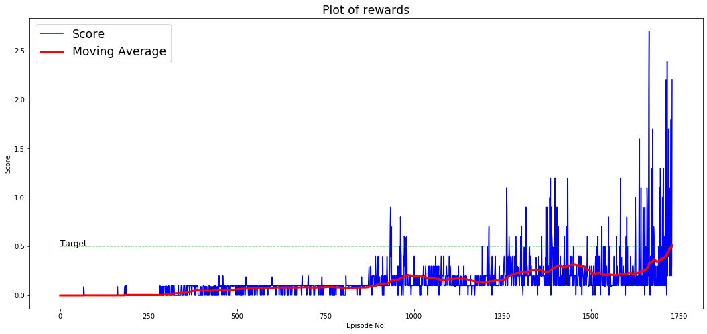

# Project 3: Collaboration and Competition

This project aims to implement a multi-agent reinforcement learning. The algorithm of choice is a Multi-Agent Deep Deterministic Policy Gradient (MADDPG) based on the paper [Multi-Agent Actor-Critic for Mixed Cooperative-Competitive Environments](https://arxiv.org/abs/1706.02275).

## Implementation
Traditional reinforcement learning approaches such as Q-Learning or policy gradient are unsuited for multi-agent environments. This is because each agent's policy is changing as training progresses, and the environment becomes non-stationary from the perspective of any individual agent. This would affect the learning stability when training and would prevent the straightforward use of past experience replays, which is important to stabilizing deep Q-learning.

Policy gradient methods are unsuited for multi agent environment as they exhibit very high variance when coordination of multiple agents is required.

Hence, the paper proposes a general purpose multi agent learning algorithm which adopts a framework of centralized training and decentralized execution. In this framework, a simple extension of actor-critic policy gradient methods is used. Here, the critic is provided with information about the policies of other agents, while the actor only has access to local information.

In decentralized execution, once training has been completed, only local actors are used at execution phase, acting in a decentralized manner. In other words, the local actors would take actions considering only its observations of the environment.

In centralized training, each agent would still have separate critic, its own local critic. However the local critic for each agent is provided data about the policies of other agents in addition to data about its own actions.

Structuring the multi agent algorithm this way enables cooperative and competitive agents to be trained.

## Learning Algorithm & Hyperparameters

In the training function, state of each individual agents is retrieved from the environment. The state values of all agents is input into the MultiAgentDDPG object to obtain actions for each agent.

For each individual agent, in the 'act' function of DDPG agent, the state value is fed into the actor local network to obtain the best-believed action based on the current policy as approximated by the actor local network.

Then noise is added to those actions in order to allow exploration of the environment. Subsequently, a set of actions for each agent is returned to the training function.

The training function then executes the action value. The environment then returns a reward and observations of the next state.

The values of the state, action, rewards and next_state are then formed into a tuple. This tuple value is input into the MultiAgentDDPG object.

This completes one loop of iteration for the training function. The state is assigned with the next state value to begin a second iteration.

### Replay Buffer

Following on from the part where a tuple is input into the MultiAgentDDPG object, the MMADDPG stores the tuple value in the buffer.

### Update of network weights

Once the buffer has accumulated enough numbers of tuples, the MADDPG executes an update of network weights based on these experience replay tuples. The update occurs once for each agent. These experience replay tuples are gathered from all agents in the environment. Hence this is how the critic acquires knowledge about other agents' policies. This is the crux of the centralized training.

#### Critic local update

For each sample of experience from the buffer, the MADDPG calculates the error between the target reward and predicted reward.

The target reward, y, is calculated by using the critic target and actor target networks.
The next_state value of the tuple is input into each agents' actor target network to predict the next actions that should be taken by each agent. Then the set of next actions and next states (from the experience tuple) is input into the critic target network. The output of this is the predicted expected reward for the next state. The predicted expected reward is multiplied by a value gamma and summed up with the reward (r) of this agent for this experience to obtain the target reward, y.

The predicted reward for that experience is obtained by using the critic local networks. The observed next_state in the experience tuple corresponding to the agent being trained in this iteration is passed into the critic local network. Another value also passed into the critic local network is the actor's actions from the corresponding same experience tuple.

The difference between target reward and predicted reward is the error for this experience.

The error is then squared and the loss calculated from the mean of the squared errors (mean squared error loss) for all experience tuples in the minibatch. This loss is then used to update the weights of the critic local network.

#### Actor local update

To update the actor local network, the mean expected return for the experiences in the minibatch (also known as the network loss) needs to be calculated.

This is done by inputting the state in the experience tuple into the respective agent's actor-local network. This would return the predicted action that would be taken by the actor. Then, this set of actions is input into the critic-local network along with the states, yielding the expected return.

Hence, to update the weights of the actor local network, the mean of all expected returns for the experiences in the minibatch is calculated to yield the network loss.

#### Critic target and actor target

Once the agents' local network has been updated, the target networks are updated next with soft update.
θ_target = τ*θ_local + (1 - τ)*θ_target
The target network parameters are periodically updated with the most recent, θ (weights), which helps stabilize learning.

### Network architecture

The network architecture consists of the actor and critic network. The Actor network receives 24 variables each representing the 24 observed states. The output of the Actor network is only 2 numbers, representing the predicted best action for that observation.

The critic network receives as input 48 variables, representing the observed state of both agents (24 variables each). The result of the Critic's first hidden layer and the actions from the Actor Network (4 variables) is input into the Critic's second hidden layer. The output of the Critic Network is the prediction of the target value based on the agent's state observations and best-believed actions.

### Hyperparameters

The following are the parameters used:

```
seed = 997
device = 'cpu'
target_score = 0.5
target_episodes = 100
num_agents = 2
action_size = 2
state_size = 24
actor_layers = [64, 64]
critic_layers = [64, 64]
actor_lr = 3e-3
critic_lr = 4e-4
lr_sched_step = 1
lr_sched_gamma = 0.1
batch_normalization = True
buffer_size = int(1e6)
batch_size = 64
gamma = 0.99
tau = 0.01
noise = True
noise_theta = 0.9
noise_sigma = 0.01
max_episodes = 10000
```

Various hyperparameters were tested during training. To reduce complexity, the network layer used mimics those discussed in the research paper. Both the actor and critic layers would have 64 units per layer. There would be two hidden layers for each network.

Multiple learning rate were tested and it was determined that an actor learning rate of 0.003 and critic learning rate of 0.0004 would be used. The learning rate of 0.01 used in the research paper was found to be too strong, thus the model could not converge. A learning rate less than the ones used above, would be too weak and the model too would not be able to converge.

The tau value for the soft-update was set to 0.01 as this was found to allow the model to converge.

During training, it was observed that the moving average oscillates quite erratically before converging. Also, as the moving average approaches the target score, the learning rate seems to be too high as the model would make a more than 20% target score improvement in the last 5% of the training episodes. To allow the model to train smoothly and obtain more reliable result, a training scheduler was used to decay the learning rate at a rate of 0.1 when the moving average reaches a target score threshold of 0.4 and 0.6.

The discounted reward factor (gamma) used was 0.99 while the noise theta was 0.9 and noise sigma was 0.01.

## Plot of Rewards

The following is the plot of rewards:

  

The environment was solved in 1631 episodes. It shows that the algorithm was able to get an average score of +0.5 (over 100 consecutive episodes, after taking the maximum over both agents).

## Ideas for Future Work

The research paper proposes that it is possible to further improve the performance of the method by training agents with an ensemble of policies.

The paper also notes that in the current algorithm the input space grows linearly with the number of agents. This could be remedied by having a modular function that only considers agents in a certain neighborhood of a given agent. This would reduce the input space by having a smaller number of agents.

# References

- https://arxiv.org/pdf/1706.02275.pdf

- https://github.com/silviomori/udacity-deep-reinforcement-learning-p3-collab-compet

- https://github.com/ekaakurniawan/DRLND/tree/master/p3_collab-compet
